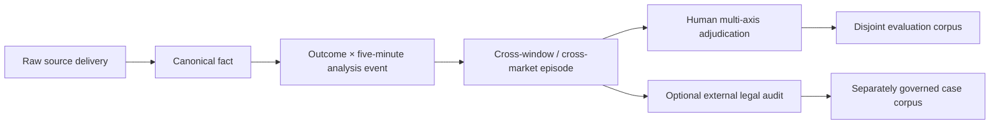
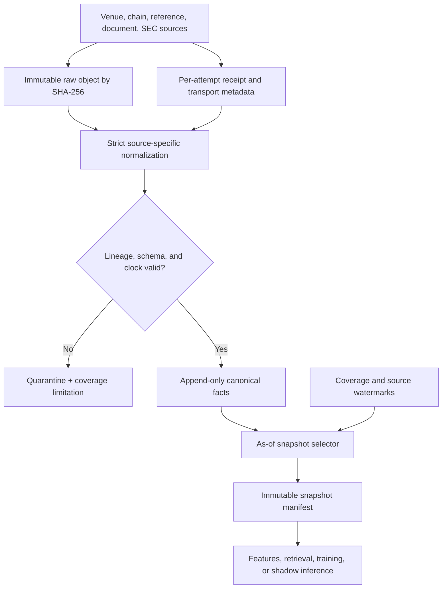
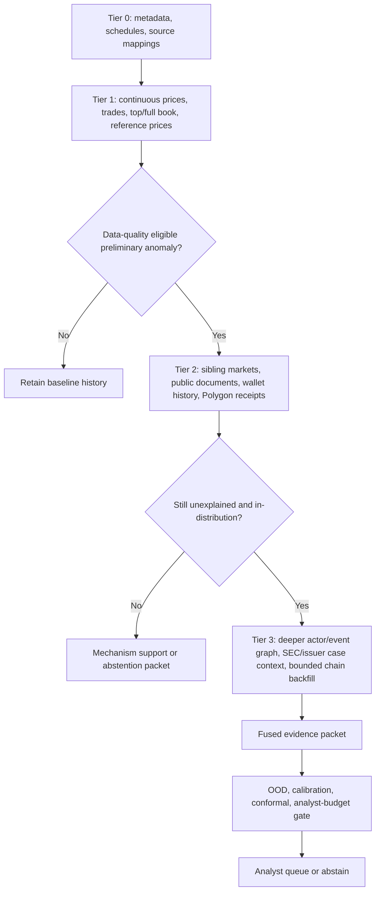
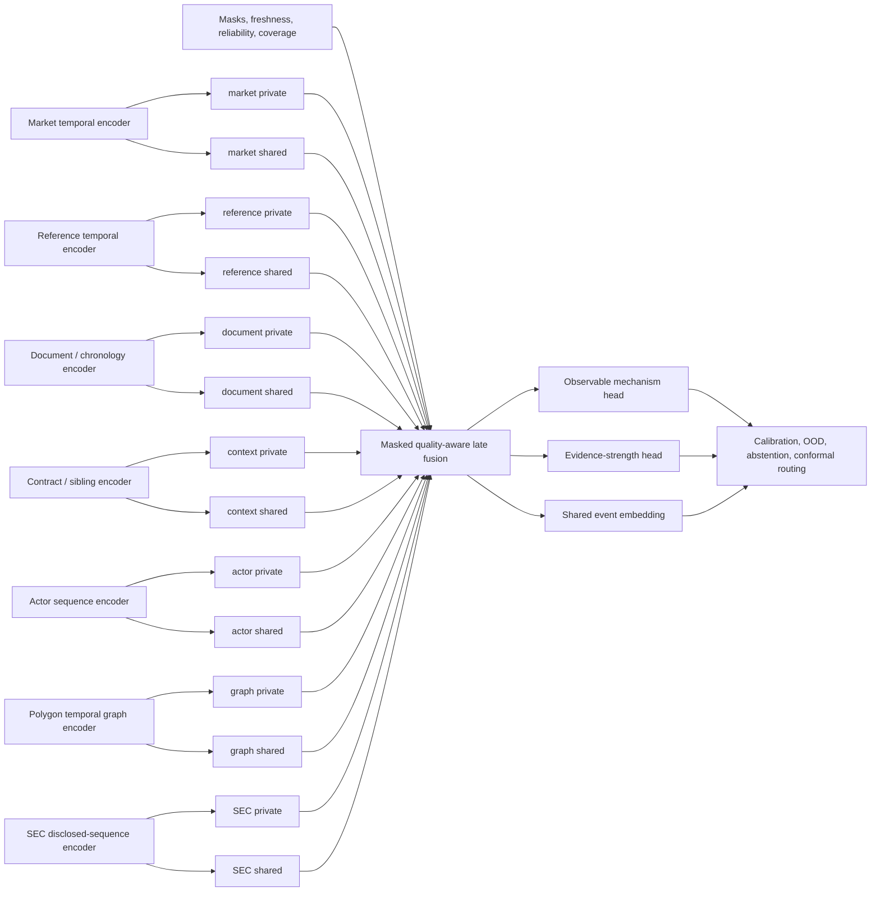
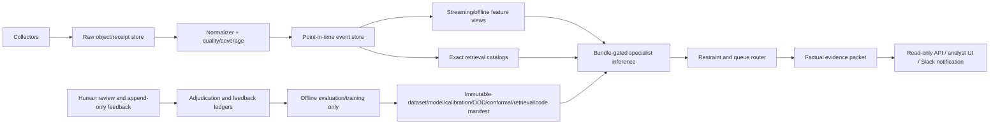

# MarketLeak multimodal architecture blueprint

## 1. Purpose, status, and claims boundary

MarketLeak is being built as a **point-in-time market-integrity and informed-flow triage system**. Its operational question is:

> Given only facts that were available at a decision cutoff, what observable mechanism best explains a market movement, how strong is the evidence, how unusual is the event relative to comparable history, and should the system abstain or route it for human review?

The target is not an autonomous accusation engine. The system may rank an event as unexplained, retrieve similar cases, or recommend review. It may not convert those outputs into a finding that a person committed fraud, possessed nonpublic information, controlled a wallet, or acted with intent.

The current empirical status remains **`effectiveness_unknown`**. The repository contains a strong causal data substrate, deterministic fusion and restraint components, calibrated baseline machinery, exact retrieval, and an experimental shared/private neural shell. It does **not** contain trained multimodal weights, a validated fraud-probability head, or a sufficiently large, exactly mapped, prospectively evaluated case corpus. The authoritative current Phase 15 boundary is documented in [phase15-multimodal.md](phase15-multimodal.md) and [validation-and-shadow.md](validation-and-shadow.md).

The permitted claims are deliberately narrower than the long-term research ambition:

| Output | Permitted interpretation | Prohibited interpretation |
|---|---|---|
| Mechanism support | Evidence is consistent with a thin-market artifact, public-information response, reference move, or another governed mechanism | The mechanism proves innocence or misconduct |
| Evidence strength | Available modalities are absent, conflicting, limited, or corroborated | Corroborated means legally proven |
| Similar-case retrieval | This event resembles prior events under a declared embedding and filter policy | Retrieved labels automatically apply to the query |
| OOD score | This event is distant from the reference population | Distance is probability of fraud |
| Queue decision | This event fits within a calibrated analyst-review policy | Escalation is an accusation |
| External legal outcome | A regulator or court published a stated procedural outcome | An allegation is a conviction, or one actor's outcome labels related actors |

## 2. Current system versus target system

| Layer | Implemented now | Target state |
|---|---|---|
| Raw capture | Content-addressed raw objects, retrieval receipts, quarantine, source coverage, canonical market records | Continuous multi-source capture with source-specific gap recovery, immutable lake partitions, and complete coverage ledgers |
| Event memory | Typed point-in-time facts for market state, public evidence, and Polygon settlement; separate market-context and reference contracts | A unified but typed event store covering all governed modalities without erasing their source-specific semantics |
| Market features | Closed five-minute price, fill, and top-of-book snapshots with lineage and missingness | Multi-horizon sequence features, full depth dynamics, signed flow, impact, reversal, volatility, cancel/order-lifetime features, and sibling controls |
| Actor features | Public actor aggregation over canonical fills: counts, notional, concentration, positions, and resolved performance | Longitudinal pseudonymous actor sequences, novelty, burstiness, funding/settlement graph motifs, peer baselines, and explicit visibility masks |
| Context/reference | Raw-lineaged contract context and fail-closed documented BTC reference support | Contract-specific reference adapters, scheduled-event and sibling graphs, and residualized market movement for every supported market family |
| Public information | Raw archive, first-seen timing, claim normalization, matching, coverage, and explanation support | Primary-source roster, entity/event graph, semantic novelty, cross-source corroboration, and time-aware document sequence encoder |
| On-chain | Strict Polygon `OrderFilled` parsing/corroboration and bounded explicit Bitcoin watch-context collection | Continuous Polygon backfill plus temporal graph features; Bitcoin remains contextual and requires an independently documented link |
| SEC/cases | No SEC Form 3/4/5 collector or normalized enforcement-case corpus in the Phase 15 model | Bulk and incremental SEC ingestion, issuer/event mapping, normal insider-sequence pretraining, and separately governed enforcement case graphs |
| Fusion | Reliability × freshness deterministic late fusion and disagreement; three-modality experimental neural forward architecture | Masked specialist encoders, shared/private representations, quality-aware late fusion, calibrated task heads, and cross-domain transfer |
| Retrieval | Separate exact `faiss.IndexFlatIP` modality indexes with causal/provenance filters and structured reranking | Case-, event-, and modality-level retrieval; ANN only after exact-search promotion gates pass |
| Restraint | kNN distance, energy-like OOD, modality/disagreement/weak-support abstention, calibration checks, rolling conformal-style routing | Validated OOD reference populations, adaptive conformal risk control by slice, drift monitoring, and explicit human capacity constraints |
| Serving | Immutable manifest verification and read-only v3 metadata/frozen-assessment endpoints | A shadow-only online scorer first; later a bundle-gated inference service feeding an analyst queue, with explanations derived from evidence packets |

## 3. Units of data, analysis, and adjudication

The architecture must keep four units distinct.

### 3.1 Raw observation

A raw observation is one source delivery: WebSocket message, REST response, document, EDGAR filing, blockchain receipt/log, or reference-price response. It is stored before parsing and has a content hash plus a separate retrieval/receive receipt.

### 3.2 Canonical fact

A canonical fact is a typed, source-lineaged observation such as a `TradeFill`, `OrderBookSnapshot`, `PublicDocumentClaim`, or verified `OrderFilled` log. It carries at least:

- stable UID and schema/parser version;
- event time;
- first-seen, retrieved, and ingested clocks where relevant;
- source UID, URL, reliability, raw-artifact UID, and SHA-256;
- explicit availability, coverage, and missingness state.

Later collection may add a new fact or revision. It must never overwrite history or make the new fact appear available to an earlier decision.

### 3.3 Analysis event

The initial analysis event is one market outcome during one completed five-minute bucket, evaluated at a fixed `as_of` cutoff. A stable event identity should bind:

```text
venue + market_uid + outcome_uid + window_start + window_end + as_of policy
```

The target sequence model consumes the current bucket plus preceding buckets at several horizons. Five minutes is the canonical base interval, not the only modeled horizon.

### 3.4 Episode and case

An episode groups causally related analysis events: sibling markets, the same scheduled or information event, linked actors/wallets, and a bounded chronology. A case is an independently curated episode that may also contain external legal records. All contracts arising from one actor and information episode remain one case cluster for splitting and uncertainty estimation; they are not independent positive examples.



Human Phase 15 adjudication predicts no legal outcome. It records observable mechanism, evidence strength, and disposition. `unknown` and `unmapped` are never negatives. External legal material remains audit-only under the current schema in [labels.py](../marketleak/multimodal/labels.py); any future legal-case research target requires a separate schema, review process, and evaluation protocol rather than silently changing that contract.

## 4. Raw-first point-in-time event store

The raw-first rule in [data-and-evidence.md](data-and-evidence.md) is the non-negotiable base of every model experiment.



For a fact to enter an `as_of = T` snapshot, both its real-world event clock and the earliest clock at which MarketLeak could use it must be no later than `T`. Publication timestamps alone do not prove observability. For public documents and SEC filings, the relevant public-information clock is SEC acceptance/first observation, not the underlying transaction date. For streaming sources, reconnect gaps and stale books become explicit coverage facts.

The currently typed Phase 15 event-memory modalities are only `market_state`, `public_evidence`, and `onchain_settlement` in [schemas.py](../marketleak/multimodal/schemas.py). Context and reference prices have separate point-in-time contracts. Target implementation should extend the governed schema deliberately; it should not pack every new source into an untyped JSON blob.

## 5. Collection waterfall

Collection is tiered so inexpensive broad surveillance triggers bounded, relevant enrichment. The trigger is a collection decision, not a finding of wrongdoing.



Tier transitions must be deterministic and auditable. A trigger records its input snapshot, rule/model bundle, cutoff, and reason. It may expand the collection basin around a market, time range, issuer, or already public pseudonymous wallet. It may not discover or infer a person's identity, crawl unrelated accounts, or use alert-created graph links as independent corroboration.

## 6. Modality and variable specification

The following table separates fields that are implemented in repository contracts/features from variables planned for the target model. “Planned” means no production-ready feature contract or validated model input exists yet.

| Modality | Current raw/canonical variables | Current derived variables | Planned variables |
|---|---|---|---|
| Market price and trades | Market/outcome IDs, event/ingest times, price; explicit fill price, size, side, actor visibility/UID where the venue exposes it; source/raw lineage | `price_observation_count`, `fill_count`, `price_open`, `price_close`, `price_change`, `trade_notional`, `mean_fill_size` | Log returns at 1/5/15/60-minute horizons; realized volatility; acceleration; reversal; signed notional; buy/sell imbalance; trade intensity; interarrival statistics; max/median/quantile size; size relative to market and actor history; VWAP deviation; price impact and recovery |
| Order book and transport | Timestamped snapshots/deltas, bid/ask levels, source sequence/lifecycle data when exposed, receive times, reconnect/coverage state | `orderbook_snapshot_count`, `best_bid`, `best_ask`, `quoted_spread`, `bid_depth`, `ask_depth`, `depth_imbalance` | Depth at fixed price bands; microprice; book slope/convexity; replenishment and depletion; cancel/add/execute rates; order lifetime where observable; sequence gaps; stale-book age; impact-adjusted move; spoofing-like patterns only as descriptive microstructure motifs |
| Market and event context | Question, category, outcomes, explicit siblings and relationship, scheduled events and state, open/close/resolution/deadline times, resolution-rule URL | Point-in-time admission and explicit context availability | Time to close/resolution; scheduled-event proximity; category/event embeddings; sibling return vector; mutually exclusive probability-sum residual; rule ambiguity features; venue/market-age priors |
| Underlying/reference | Per-market documented mapping, rule URL, primary-source URL/status, asset/quote, observation kind, raw price, candle timing/finality, all availability clocks | Fail-closed admission status; current narrow BTC ticker/candle support | Reference returns and volatility at matched horizons; lagged cross-correlation; beta/residual market move; distance to strike/threshold; settlement-boundary proximity; reference-source disagreement only when contractually relevant |
| Public information | URL, document and claim IDs/hashes, text, entity IDs, claimed publication, first-seen/retrieval/modified times, source reliability and coverage | Claim normalization/matching and public-explanation support outside the numeric neural vector | Source roster coverage; relevance; novelty versus prior documents; entity/event links; publication-to-market lag; claim contradiction/agreement; scheduled versus surprise status; text embedding; evidence chronology embedding; first-observed coverage mask |
| Prediction-market actor | Public `proxyWallet` or other explicitly exposed actor UID, actor visibility, fills, direction, price, size, market/outcome, time | Fill/market/outcome counts; gross notional; directional concentration; per-outcome net size, gross buys/sells, cash flow; resolved performance | Actor age; prior activity rate; burstiness; market/category novelty; position size versus own history; timing to event; entry/exit/reversal behavior; cross-market concentration; funding recency; coordinated temporal motifs; peer-normalized behavior; visibility and history-length masks |
| Polygon execution/settlement | Chain/contract, transaction and block hashes/numbers/times, log index, order hash, maker/taker addresses, side, token, maker/taker amounts, fee, builder, metadata, raw lineage | Exact join/corroboration status to canonical venue fill; no inferred identity or intent | Continuous backfill coverage; transaction/settlement lag; funding and transfer chronology from approved contracts; temporal graph embeddings; counterparty diversity; repeated co-occurrence motifs; entity resolution only for independently documented public links |
| Bitcoin context | Explicit watch registration; address summary transaction/funded/spent counts and sums; UTXOs; transaction state, size, weight, fee, block; endpoint coverage | Bounded raw-lineaged context snapshot; deliberately no risk score or Polymarket attribution | Only contextual timing/flow aggregates after an independently documented market link; never automatic Bitcoin↔Polygon linking, identity inference, settlement substitution, or generic wallet clustering |
| SEC Forms 3/4/5 | **Not implemented.** Target raw fields: accession/acceptance/filing metadata, issuer CIK/ticker, reporting-person CIK, role/title/relationship, transaction date/code, shares, price/value, holdings, direct/indirect ownership, derivative fields, footnotes, amendment and 10b5-1 indicator where present | None | Public-observability chronology; open-market `P`/`S` sequences; actor/issuer historical baselines; role and plan context; issuer-event proximity; disclosed sequence embeddings; filing novelty and amendments. Grants, gifts, derivatives, and amendments remain separate transaction families |
| Enforcement and case graph | **Not implemented as a normalized target corpus.** Public complaint/order/judgment documents may enter the ordinary evidence archive | Optional external legal audit exists but is not training eligible | Authority, procedural status, actor/account or pseudonymous wallet, issuer/market/instrument, information event, access window, trade window/direction/size, disclosure, profit/avoided loss, source URLs, mapping grade, independent-case cluster, supersession/outcome history |
| Quality and provenance | Source UID/class/reliability, content hash, raw artifact UID, parser version, event/first-seen/retrieved/ingested clocks, coverage, source high-watermarks, missingness | Freshness, reliability weighting, explicit modality masks, readiness reason codes | Gap duration/count, sequence continuity, parser drift, feature age, source disagreement, mapping confidence, case-mapping grade, per-feature availability mask, observation-density and history sufficiency |

The exact implemented five-minute numeric market feature contract is in [features.py](../marketleak/multimodal/features.py). Planned variables must receive versioned feature definitions, causal tests, and lineage references before entering a model.

## 7. Target representation and fusion architecture

Each modality receives a specialist encoder appropriate to its structure. A single forced common vector would discard order-book geometry, document language, and graph topology. Each specialist therefore emits:

- a **private representation** retaining modality-specific detail;
- a **shared representation** intended to express cross-domain concepts such as timing, concentration, novelty, abruptness, and evidence agreement;
- an observed/missing mask, freshness, reliability, and coverage vector.



Initial specialist choices should be deliberately modest:

- temporal convolution or small Transformer for market/reference/actor sequences;
- MLP for static contract, schedule, and quality values;
- frozen text embedding plus a small trainable projection for public documents;
- temporal graph network or GraphSAGE-style baseline for approved Polygon event graphs;
- Transformer or recurrent sequence baseline for SEC ownership transactions;
- masked gated late fusion before considering cross-modal attention.

The current [neural.py](../marketleak/multimodal/neural.py) is a smaller experimental shell: three private MLP encoders (`market`, `evidence`, `onchain`), private-to-shared projections, Boolean modality masks, concatenative late fusion, and mechanism/evidence heads. It has no default weights, training loop, or approved serving bundle. The target architecture must first beat simpler late-fusion baselines.

## 8. Learning objectives — proposed and not implemented

**None of the neural losses in this section is implemented in the repository today.** They are hypotheses to be preregistered and ablated, not descriptions of a working training pipeline.

An initial multi-task objective is:

```text
L_total =
    λ_mech  · L_mechanism
  + λ_evid  · L_evidence
  + λ_time  · L_masked_temporal
  + λ_xmod  · L_cross_modal_contrastive
  + λ_sep   · L_shared_private_separation
  + λ_drop  · L_modality_dropout_consistency
  + λ_ret   · L_retrieval_metric
```

| Loss | Proposed role | Guardrail |
|---|---|---|
| `L_mechanism` | Class-balanced cross-entropy or focal loss over human-adjudicated observable mechanisms | Exclude unknown/unmapped; report per-class support; compare against deterministic and boosted baselines |
| `L_evidence` | Ordinal or categorical loss over evidence strength | Do not reinterpret evidence strength as legal certainty |
| `L_masked_temporal` | Reconstruct/predict masked or next-step market, actor, reference, or SEC events | Use only past context; prevent future announcement or case-outcome leakage |
| `L_cross_modal_contrastive` | Align shared representations from the same episode and separate causally unrelated episodes | Negatives must respect event/issuer/actor clusters; avoid false negatives from related markets |
| `L_shared_private_separation` | Penalize redundant shared/private encodings, for example cross-covariance or orthogonality loss | Ablate it; do not assume mathematical separation improves decisions |
| `L_modality_dropout_consistency` | Teach graceful behavior under legitimately missing modalities | Preserve an explicit mask; never make unavailable equal observed zero |
| `L_retrieval_metric` | Improve same-mechanism or same-episode retrieval under curated relevance judgments | Retrieval labels do not become decision labels |

A supervised “fraud probability” loss is intentionally absent. It can be proposed only after a separately governed corpus supplies independently adjudicated, exactly mapped cases and a defensible evaluation population. Until then, positive–unlabeled methods may rank resemblance to curated positives or estimate latent structure, but their scores must be named accordingly—never calibrated fraud probabilities.

Loss weights are experiment configuration. They must be selected on a frozen validation partition and included in the immutable bundle manifest. No loss may optimize analyst feedback and then report that same feedback period as prospective performance.

## 9. Positive–unlabeled case corpus and SEC transfer

Public data offers many known or alleged positive cases, large volumes of ordinary market behavior, and very few trustworthy case-level negatives. “Not charged” does not mean “adjudicated no misconduct.” The appropriate research framing is therefore positive–unlabeled (PU), with procedural status and mapping confidence preserved.

### 9.1 Case mapping grades

| Grade | Minimum mapping | Permitted use |
|---|---|---|
| A | Exact account/wallet or stable pseudonymous actor, exact transactions, event chronology, and final external outcome | Separately governed supervised case research and retrieval benchmark |
| B | Actor, instrument/market, bounded transaction window, event chronology, and final outcome | Episode-level supervised sensitivity analysis; never transaction-level ground truth |
| C | Case and issuer/market known but transactions incomplete | Retrieval, weak supervision, qualitative testing |
| D | Allegation only, ambiguous mapping, or unresolved identity/instrument links | Evidence archive and prospective follow-up only |

The legal-status dimension must distinguish complaint/charge, disciplinary finding, settlement/consent order, final civil judgment, criminal conviction, dismissal, and exonerating outcome. Documents and outcomes are versioned because cases evolve.

### 9.2 SEC transfer strategy

SEC Forms 3/4/5 are not fraud labels. They are useful in two separate ways:

1. **Point-in-time public information.** For an issuer-linked prediction market, a Form 4 accepted and observed before the market movement can be part of a public explanation. A later filing cannot explain an earlier move.
2. **Self-supervised source-domain pretraining.** Large disclosed ownership-transaction sequences can teach timing, concentration, novelty, role, issuer, and transaction-family representations. Enforcement cases can then provide a much smaller, separately curated set of abnormal chronologies.

The stock-market and prediction-market domains should share only abstract informed-flow concepts. Their mechanics remain private to their specialist encoders. SEC transfer is most plausible for earnings, M&A, leadership, product, issuer-regulatory, or other corporate-event contracts; it should not be applied indiscriminately to sports, weather, or elections.

Required SEC ablations are:

```text
deterministic Form 4 features
vs target-domain-only model
vs frozen SEC-pretrained encoder
vs SEC pretraining + target-domain fine-tuning
```

Promotion requires improvement on issuer-disjoint, actor-disjoint, and forward-time target tests, plus placebo tests using unrelated issuers and shifted filing times. If the transfer does not improve target performance and calibration, it is removed.

## 10. Retrieval and case memory

Retrieval remains separate by modality. The existing implementation in [retrieval.py](../marketleak/multimodal/retrieval.py) uses normalized embeddings, one exact `faiss.IndexFlatIP` shard per current modality, point-in-time and coverage filters, encoder/content hashes, and structured reranking over relevance, entity, time, provenance, and reliability.

The target adds three retrieval views:

- **fact retrieval:** similar documents, market windows, actor windows, or graph neighborhoods;
- **episode retrieval:** similar cross-modal chronologies;
- **case retrieval:** curated enforcement or adjudication cases with mapping-grade and legal-status filters.

Retrieved items support an evidence packet; they never assign the query's label. Exact Flat search remains the benchmark. HNSW or IVF-PQ may be introduced only after predeclared Recall@K, temporal-provenance, missing-modality, calibration, and operational-latency gates pass against the exact catalog.

## 11. Calibration, OOD, abstention, and conformal routing

The restraint layer is part of the decision system, not post-processing decoration.

### 11.1 Calibration

Mechanism/evidence confidence and operational queue support are calibrated only when minimum label and class counts pass. Brier score and expected calibration error are withheld otherwise. A mechanism score must not be presented as a probability of fraud.

### 11.2 Out-of-distribution detection

The current [uncertainty.py](../marketleak/multimodal/uncertainty.py) provides k-nearest-neighbor distance and an energy-like distance against an explicit reference set. The target retains multiple OOD views:

- global fused-embedding distance;
- modality-specific distance;
- missingness/coverage-pattern novelty;
- disagreement between specialist predictions;
- drift by venue, market family, liquidity regime, and time.

OOD thresholds are fitted without test data and reported by operational slice. An unavailable or undersized reference population causes abstention.

### 11.3 Selective prediction

The model may output a mechanism, `unknown`, `unmapped`, `insufficient_evidence`, or abstain. Reasons include:

- insufficient observed modalities or history;
- incomplete source coverage, reconnect gap, stale book, or unmapped reference;
- weak top support;
- excessive cross-modal disagreement;
- unavailable calibration;
- insufficient OOD reference data or excessive OOD score;
- unavailable case or context mapping.

### 11.4 Adaptive conformal-style operational control

The current rolling controller uses analyst feedback available by the decision cutoff, withholds escalation when feedback is insufficient, adjusts a conservative threshold using unsupported escalations, and caps the daily analyst queue. “Supported” means the escalation was useful to the analyst workflow—not that fraud occurred. Target promotion requires a statistically justified conformal risk-control method with finite-sample assumptions documented for each deployment slice.

## 12. Evaluation design and promotion gates

AUROC may be reported as a ranking diagnostic, but it is insufficient for a rare-event analyst queue. Primary operational metrics are:

- precision among the top `K` reviewable cases;
- recall at a fixed analyst-day budget;
- false escalations per analyst-day;
- PR-AUC for rare supported events;
- Brier score and expected calibration error when label counts are adequate;
- coverage versus selective risk as abstention changes;
- median detection delay and duplicate-alert rate;
- OOD detection and drift behavior by slice;
- exact-retrieval Recall@K and temporal/provenance violation count.

All partitions must be forward-time and disjoint by event cluster, market, actor/wallet, and—where applicable—issuer. Closely related contracts from one enforcement episode stay in one partition. Evaluation includes unseen venues/market families, missing-modality stress, source outages, thin/deep liquidity regimes, and chronology placebos.

### Required gates

| Gate | Acceptance condition |
|---|---|
| Data integrity | Every model input links to an admitted as-of fact and raw receipt; no future event, retrieval, filing, or outcome leaks backward |
| Coverage | Required sources have complete declared coverage, or the candidate abstains with the exact limitation |
| Label governance | Human mechanism/evidence labels are training eligible; unknown/unmapped excluded; case outcome tier and mapping grade preserved separately |
| Split integrity | Automated checks show no event/market/actor/issuer cluster crosses partitions |
| Baseline superiority | Proposed model beats preregistered deterministic/logistic/gradient-boosted late-fusion baselines on primary metrics and important slices |
| Calibration | Minimum class counts pass; Brier/ECE and reliability diagrams meet the frozen plan |
| Selective risk | Risk decreases as abstention increases; false escalations remain within the analyst-day budget |
| OOD | Known shifts and held-out families are detected without intolerable in-distribution abstention |
| Retrieval | Exact-search Recall@K and zero temporal/provenance violations pass; ANN separately matches the exact benchmark before promotion |
| Prospective shadow | Frozen bundles run on future data without retraining or threshold changes; reproducibility and queue metrics remain within bounds |
| Claims review | UI, API, evidence packets, and demos use governed language and expose limitations, coverage, bundle ID, and decision cutoff |

No single aggregate threshold is enough. Promotion requires predeclared slice floors and uncertainty intervals. A failed gate produces `not_ready`, shadow-only status, or abstention—not a waiver.

## 13. Serving and deployment blueprint



Training and bundle creation remain offline. Online components may load only an explicitly approved immutable bundle whose manifest binds dataset, feature specification, model, calibration, OOD, conformal, retrieval, and code hashes. Secrets stay in server-side collectors. LLMs, if used, operate downstream for entity resolution, claim extraction, chronology formatting, or evidence completeness audits; they neither calculate graph facts nor produce the governed probability or final disposition.

The existing [serving.py](../marketleak/multimodal/serving.py) and bundle contracts in [bundles.py](../marketleak/multimodal/bundles.py) deliberately expose verified metadata and frozen assessments without loading model bytes or running live inference. The deployment path is:

1. local/offline experimentation;
2. replay evaluation on frozen historical snapshots;
3. prospective shadow scoring with no analyst-facing alert;
4. analyst-visible shadow queue clearly marked experimental;
5. limited, bundle-gated review routing after all operational gates pass;
6. broader deployment only after monitored prospective performance and governance review.

## 14. Phased implementation plan

### Phase A — freeze contracts and acceptance scenarios

- Version the analysis-event, episode, case, modality, feature, and label schemas.
- Define case mapping grades and legal procedural states separately from Phase 15 labels.
- Turn the architecture claims boundary and causal-clock rules into executable acceptance scenarios.

**Acceptance:** schema fixtures round-trip; future facts and unknown-as-negative examples fail tests; every planned output has a permitted interpretation.

### Phase B — expand continuous core intake

- Harden Polymarket/Kalshi streaming capture, reconnect-gap accounting, and sequence continuity.
- Persist complete trade and book history for a fixed market roster.
- Expand documented contract metadata, scheduled events, siblings, and reference mappings.

**Acceptance:** preregistered collection windows produce raw hashes, receipts, normalized rows, watermarks, and honest complete/partial/unavailable coverage reports; replay is deterministic.

### Phase C — build versioned multi-horizon features

- Add market flow, depth dynamics, impact/reversal, quality, context, sibling, and reference residual features.
- Add actor longitudinal features with explicit visibility/history masks.
- Attach every feature to exact source fact UIDs and a feature-spec hash.

**Acceptance:** causal feature tests reject post-cutoff inputs; golden replays are byte-stable; missing modalities differ from observed zeros.

### Phase D — establish the public-information and SEC substrate

- Operate a small primary-source archive with first-seen coverage.
- Ingest official SEC bulk Forms 3/4/5 and incremental EDGAR ownership filings raw-first.
- Normalize transaction families, amendments, roles, issuers, and acceptance clocks.
- Map only issuer-relevant prediction markets with confidence and provenance.

**Acceptance:** no later filing explains an earlier event; `P`/`S`, grant, gift, derivative, plan, and amendment families remain distinguishable; issuer-mapping placebos fail closed.

### Phase E — build the PU case graph

- Normalize public regulator/court case documents and outcome histories.
- Curate mapping grades, transaction windows, information events, actors/accounts, instruments, and independent case clusters.
- Double-review A/B mappings; preserve allegations and unresolved cases without promoting them to proven positives.

**Acceptance:** every field has source evidence; inter-reviewer agreement and mapping disputes are reported; train/test clustering prevents case-family leakage.

### Phase F — train specialist baselines

- Train deterministic, logistic, and gradient-boosted modality specialists and calibrated late fusion.
- Establish source, market-family, liquidity, missingness, and temporal slices.
- Freeze the first prospective evaluation plan and analyst budget.

**Acceptance:** readiness gates pass; calibration is available only at sufficient counts; shadow queue metrics beat naive price-z-score and volume-only baselines.

### Phase G — introduce retrieval and neural representations

- Produce versioned embeddings and exact per-modality/event/case catalogs.
- Implement the proposed specialist encoders and shared/private fusion behind experiment flags.
- Run SEC-transfer, modality, loss, and encoder ablations.

**Acceptance:** neural candidate improves predeclared primary metrics and calibration on unseen time/market/actor/issuer partitions; exact retrieval passes recall and temporal-provenance gates; otherwise baselines remain preferred.

### Phase H — validate restraint and prospective operation

- Fit OOD reference populations without test leakage.
- Validate abstention curves, source-outage behavior, and modality disagreement.
- Run rolling conformal-style routing under fixed daily analyst budgets.

**Acceptance:** false escalations per analyst-day remain within the declared bound; insufficient history causes abstention; selective risk improves with abstention across required slices.

### Phase I — immutable shadow deployment

- Bind dataset, feature, model, calibration, OOD, conformal, retrieval, and code artifacts into an immutable bundle.
- Deploy read-only evidence packets and shadow routing.
- Monitor drift, gaps, latency, duplicate alerts, calibration, and analyst feedback.

**Acceptance:** fresh prospective runs reproduce from manifests, expose exact cutoffs and limitations, do not call an LLM for governed decisions, and pass an independent architecture/claims review before any operational promotion.

## 15. Non-negotiable invariants

1. Raw source delivery is stored before parsing.
2. Event time and system availability time are both enforced.
3. Missing, unavailable, unknown, and observed zero remain different states.
4. A price observation is not silently converted into a fill.
5. An alert-created graph edge cannot corroborate the same alert.
6. Bitcoin context cannot identify a Polymarket participant or substitute for Polygon settlement evidence.
7. SEC disclosed trades are not fraud labels.
8. An allegation is not an adjudicated positive, and an uncharged case is not a negative.
9. Related markets, actors, issuers, and case episodes cannot leak across evaluation partitions.
10. Retrieval resemblance is not label transfer.
11. OOD, support, and mechanism scores are not probabilities of fraud.
12. LLM output cannot create ground truth, compute transaction sums/paths, or make the governed decision.
13. No model enters protected inference without an approved immutable bundle.
14. A failed evidence, coverage, calibration, OOD, or policy gate causes abstention or `not_ready`.

This blueprint is the target design contract. Statements labeled current are grounded in repository behavior as of this document; statements labeled planned or proposed require implementation, tests, evaluation, and independent promotion before they may be described as working capabilities.
