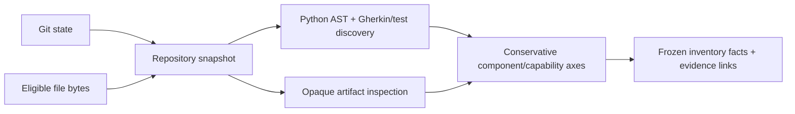

# Repo Cartographer MVP architecture

## Purpose and scope

Repo Cartographer is a small, additive repository-inventory subsystem inside MarketLeak. Its immediate job is to make a bounded, evidence-linked answer to: **what exists at this Git state, and what evidence supports that description?**

It is not a second MarketLeak architecture, a model registry, an agent runtime, or a claim about market-prediction effectiveness. MarketLeak remains `effectiveness_unknown` under the repository contract. The cartographer can establish engineering facts such as a file hash, a static symbol, an unexecuted test declaration, or an artifact-manifest binding. It cannot establish fraud, intent, identity, trained-model provenance, runtime behavior, or model effectiveness from those facts alone.

The first consumer is MarketLeak itself. The implementation is deliberately generic enough to be useful later, but it remains in this repository while it helps finish MarketLeak.

## Current MVP

The current MVP is a deterministic Python-library workflow:

Implemented boundaries:

- `snapshot_repository` records Git state and hashes eligible files by repository-relative path.
- Static discovery uses Python's built-in AST; it does not import or execute repository code. It discovers Python symbols/imports/static entrypoints, test declarations, and Gherkin feature scenarios.
- Artifact inspection reads bounded bytes and JSON manifests only. Executable artifact formats remain opaque.
- Status derivation keeps seven separate axes: definition, integration, verification, artifact, learning, evaluation, and runtime.
- Canonical JSON, stable SHA-256 identities, sorting, source hashes, evidence IDs, and reason codes make equivalent runs inspectable and comparable.
- The standalone CLI exposes `scan`, `verify`, and output-only `explain` commands over canonical JSONL, a root-hash manifest, and a bounded summary.
- A separate curated projection consumes only a verified rendered inventory and the strict `repo-cartographer-curated-profile/v1` profile. It maps exact selectors into stable, human-scale MarketLeak capability IDs while retaining the seven independent axes.
- Curated maps bind the semantic profile SHA-256 and source inventory root SHA-256, are written canonically and atomically, and can be explained or diffed by stable ID. Profile changes are rejected from repository-progress diffs.
- Executed pytest evidence is a separate immutable receipt overlay. It runs only by explicit command against a policy-bounded, hash-checked temporary frozen copy and emits externally HMAC-attested v2 receipts; static scan output and low-level inventory formats remain unchanged.

The MVP does not yet provide a database, daemon, web dashboard, runtime probe, parser beyond Python/Gherkin, language-server index, semantic index, agent ledger, or automatic capability approval. Static scanning never executes tests. A separate explicit bounded `run-tests` adapter executes approved inventoried pytest declarations in a hash-checked frozen copy and emits a receipt overlay. “Verify” means bounded static/hash/manifest and referential verification; “explain” returns the supporting/refuting evidence and reason codes already held in rendered inventory output.

## Identity and reproducibility

The scan identity binds the Git context, scan configuration hash, scanner version, and Merkle-like file-root hash. File facts use normalized repository-relative POSIX paths and exact byte hashes. Stable identities deliberately exclude the local absolute checkout root and scan timestamps so equivalent checkouts can compare results.

The scanner does not hide uncertainty. Sensitive, oversized, unparseable, ignored, deleted, missing, or artifact-mismatch conditions are retained as explicit parse statuses, tracked states, verification states, or reason codes. They are not coerced to a clean negative.

## Status derivation boundary

The cartographer derives only conservative engineering states. For example, a static import can support `statically_wired`; it cannot support `dynamically_reachable`. A declared test can support `test_declared`; it cannot support `test_passed`. Model artifact bytes can support `bytes_present` or `hash_verified`; they cannot support `trained_verified` without independently captured training provenance.

The complete rule table is in [status-rules.md](status-rules.md). The observable acceptance contract is [repository_cartographer.feature](../../specs/cartographer/repository_cartographer.feature).

## Curated MarketLeak projection

The raw inventory is deliberately symbol-level and therefore too granular to be the everyday roadmap. The checked-in MarketLeak profile aggregates exact low-level names into stable capabilities covering ingestion, market state, wallets, public information, multimodal modeling, evaluation, serving, review, and repository tooling. Required selector misses stay visible as gaps. Optional selectors are displayed but never promote status.

This layer does not use fuzzy or semantic matching. A profile edit and a repository edit are different events: changing the taxonomy changes the profile hash; changing repository evidence changes the source inventory root. See [curated-marketleak-map.md](curated-marketleak-map.md).

Receipt-aware projection is described in [test-receipts.md](test-receipts.md). Receipt and approved runner-policy hashes are included only when receipts are supplied, preserving no-receipt map serialization. A canonical self-hash is integrity evidence only; promotion requires the exact approved runner policy and a trusted external v2 attestation.

## Future adapters and indexes

Tree-sitter parsing, SCIP reference resolution, semantic retrieval, runtime probes, and an append-only agent ledger are target design, not current behavior. They must keep the same evidence boundary: a candidate found by a parser, reference index, similarity search, or agent log is not promoted without the specific evidence required by its state rule.

Antigravity's token-efficient-routing skill remains responsible for choosing an execution model and escalation path. A future Antigravity adapter may supply that router with a frozen snapshot ID and return task/verification ledger evidence. It must not replace the routing skill, consume private logs implicitly, or treat routing success as proof that a repository capability works.
