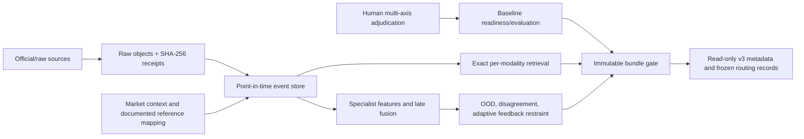

# Phase 15 multimodal architecture and operator workflow

## Scope and current limitation

Phase 15 is an evidence and restraint architecture for research and human review. It is not a deployed fraud predictor. The current empirical status is **`effectiveness_unknown`**: no frozen, sufficiently large corpus of independently adjudicated, exactly market-mapped cases and no adequate prospective evaluation establish predictive effectiveness. A bundle hash, a neural architecture, a candidate evaluation, or an analyst queue entry does not change that status.

The architecture is designed to answer bounded operational questions: what was observable at a cutoff, which non-personal market mechanism is supported by the available facts, and whether the system should abstain. It must never convert a score into a legal conclusion, an identity claim, or a claim of intent.



The arrows are evidence lineage and gating relationships, not a claim that every component is active in production.

## 1. Point-in-time event memory

The event store accepts only typed, immutable facts with raw provenance and source reliability:

- `MarketStateSlice` for market observations;
- `PublicDocumentClaim` for archived public evidence;
- `OnChainSettlementFact` for restricted verified chain facts.

Each fact has an `event_time`, `ingested_at`, raw artifact hash/UID, source URL where applicable, and source reliability. A snapshot at `as_of` includes only records whose event and availability clocks are no later than the cutoff. Later retrieval or publication cannot be backfilled into a historical decision.

Market context is a separate raw-lineaged contract: question, category, outcomes, documented siblings, scheduled-event controls, and resolution schedule. A scheduled future event is allowed as context only if the control was already observed and ingested before the decision cutoff. It does not label a movement, assign suspicion, or make an activity diagnostic scorable by itself.

## 2. Labels and human adjudication

Phase 15 uses a multi-axis human ontology instead of a binary fraud label:

- observable mechanism, such as `thin_liquidity_artifact`, public-information response, scheduled-event response, underlying-reference move, sibling repricing, or `unexplained_activity`;
- evidence strength: absent, conflicting, limited, corroborated, unknown, or unmapped;
- human disposition: benign mechanical/public response, escalate for review, insufficient evidence, unresolved, unknown, or unmapped.

`unknown` and `unmapped` are never negatives or training-eligible labels. Optional external legal outcomes are audit-only and cannot make a case trainable. The LLM, when used elsewhere for extraction or chronology formatting, is not a ground-truth generator or final decision authority.

## 3. Market features: no Phase 15 hard liquidity cutoff

The legacy v2 `thin_liquidity_threshold` remains a v2 diagnostic tag used with its causal detector. It should not be interpreted as a Phase 15 fraud threshold, an exclusion rule, or an approval rule.

Phase 15 feature snapshots are causal five-minute buckets. They keep `last_trade`, `midpoint`, `best_bid`, and `best_ask` series distinct; the compatibility `price_open`, `price_close`, and `price_change` fields alias only `last_trade`. A series change is unavailable unless at least two distinct event times exist. Matching fill and `LAST_TRADE` observations from the same raw trade frame are deduplicated, while bid/ask observations never become trade returns.

Top-of-book sides and depths have independent observed masks. A one-sided book preserves the observed side instead of failing construction. Midpoint, quoted spread, and depth imbalance are derived only from causally synchronized sides; asynchronous sides remain independently visible but do not form a fabricated pair. Kind-specific price series retain source, raw-artifact, and contributing-record lineage. These contracts make sparse-market conditions inspectable without a hard-coded `if volume < threshold` decision.

## 4. Specialist baseline and neural readiness gates

The first evaluable model path is calibrated, interpretable specialist baselines and late fusion. For the compatibility-named naive baselines, orchestration v5 admits only the checked-in immutable `NaiveBaselineFeatureSpec`; its canonical hash identifies the versioned derivation semantics. Assembly recomputes `price_change` and `volume` from frozen, exactly scoped `MarketStateSlice` facts rather than trusting caller numbers:

- the primary event is the terminal `MarketStateSlice`; its `event_time` must equal `window_ends_at`, and it fixes one exact 300-second lookback window;
- admitted market slices must cover that full window contiguously and without gaps, overlaps, subsets, or out-of-window/multiday facts;
- `price_change` is the last non-null trade price minus the first non-null trade price within that window and requires at least two distinct trade-price event times;
- `volume` sums each admitted slice's non-null observed `trade_notional` exactly once;
- the feature observation clock is the terminal window end and availability is the maximum availability clock across the exact-window market slices;
- feature identity is the exact `(market_uid, outcome_uid)` pair, including the primary event fact;
- admitted sources are restricted to exact-identity `MarketStateSlice` facts and exact-identity `OnChainSettlementFact` actor facts with a non-null `observed_wallet_uid`;
- admitted on-chain facts must also fall within that exact window and be available no later than the market-derived feature availability. They may contribute a pseudonymous actor UID for split provenance, but never a numeric naive-baseline value. Cross-outcome market facts, unrelated or unidentified actor facts, and all other source modalities fail closed.

Caller identity, values, clocks, source/raw lineage, specification hash, snapshot UID, and cutoff must exactly match recomputation. The snapshot manifest's `as_of` must exactly equal the assembly cutoff. Unknown specifications, insufficient price history, missing volume, or any mismatch fail closed. Identical duplicate feature UIDs are deduplicated and conflicting duplicates are rejected.

Assembly identity is also content-bound. `input_hash` canonically covers complete accepted rows—including the feature declaration, labels/adjudication, coverage/context, derived values, fixed-window clocks, modality, and actor provenance. Every excluded record retains and hashes the complete immutable caller input plus its reason, so distinct rejected bodies cannot collapse to one identity. `run_uid` binds orchestration v5, `as_of`, the snapshot manifest, feature-specification hash, input hash, and accepted/excluded identities. Direct `AsOfAssembly` construction reruns causal and window derivation and verifies both hashes; changing a label, coverage state, rejected payload, exclusion reason, derived value, window, input hash, or run UID fails closed. Input ordering and exact duplicates do not change the canonical result.

This is a narrow deterministic contract for the two current naive compatibility baselines. It is not a general feature-computation pipeline and does not validate proposed specialist, multimodal, wallet-sequence, SEC, or neural features. A candidate can be evaluated only after the as-of event snapshot and admitted naive features meet all applicable gates:

- every feature input is recomputed and bound to the exact as-of snapshot and cutoff, with feature observation/availability clocks, admitted source-fact UIDs, exactly matching raw-artifact UIDs, and the checked-in feature-specification hash;
- no future or later-available facts or feature rows;
- complete required coverage and context;
- human adjudications present and training eligible;
- fixed forward, event-cluster-, market-, and actor-disjoint partitions, with actor identifiers derived only from admitted fact provenance and cross-boundary groups dropped;
- explicit baseline labels and a fixed plan;
- separately predeclared validation and untouched-test minimum labeled, positive, and negative counts, counted over unique evaluation row UIDs.

Even `ready_for_candidate_evaluation` does not allow serving. Candidate metadata is unapproved and unpublished by construction.

The shared/private event-space neural module is experimental. It accepts precomputed numeric modality values and masks, retains private modality features alongside a shared representation, and applies late fusion. It has no default weights, does not collect data, and does not silently replace an unavailable runtime with a heuristic. Protected execution now fails closed unconditionally: a Boolean, manifest, or arbitrary caller object cannot unlock it. The repository has no cryptographically bound, independently approved object tying an in-memory `state_dict`, model specification, calibration artifacts, and operational attestation together.

## 5. Retrieval before ANN

Retrieval uses separate modality indexes and exact `faiss.IndexFlatIP` search over already-produced embeddings. Metadata is filtered by time, source coverage, provenance, and modality before results are returned. Retrieval is case/context support, not a labeler.

HNSW and IVF-PQ are deliberately unavailable. Promote an ANN implementation only after it meets predeclared gates against exact Flat retrieval: Recall@K, temporal holdouts, provenance behavior, calibration/selective-risk behavior, and missing-modality behavior. A faster index is not a substitute for validated retrieval geometry.

## 6. Restraint layer: OOD, abstention, and adaptive feedback routing

The restraint layer can abstain for insufficient observed modalities, weak support, cross-modality disagreement, unavailable calibration, insufficient OOD reference data, or an out-of-distribution result. Cross-modal disagreement is the maximum bounded Jensen-Shannon distance between observed specialists on a common mechanism axis, so specialists that support disjoint mechanisms produce maximal disagreement even when their score maps are sparse. OOD scoring is based on an explicit reference population using k-nearest-neighbor distance and an energy-like distance measure; its score is not a probability of fraud.

The `AdaptiveFeedbackThresholdController` uses only analyst feedback available by `as_of`. It withholds escalation when feedback history is insufficient, adjusts an empirical operational threshold from unsupported escalations, requires scores to be strictly above that threshold, and respects an analyst daily queue budget. Its `supported` field means useful to the analyst workflow, not a legal or misconduct label. This is a heuristic and makes no conformal coverage or finite-sample risk-control guarantee. `RollingConformalRiskController` remains only as a deprecated compatibility name.

Calibration also fails closed: if one-vs-rest isotonic calibration yields all-zero class support, calibration is unavailable. The implementation does not return the uncalibrated support as a fallback.

## 7. Immutable bundles and read-only v3 serving

An immutable serving manifest binds SHA-256 hashes for the dataset, feature specification, model artifact, calibration, OOD, conformal, retrieval, and code. Repository verification reads JSON pointer/manifest metadata and checks the pointer identity; it does not deserialize weights.

The v3 API is intentionally one-way and read-only:

- readiness and model-status endpoints expose verified identifiers and policy state;
- assessments expose only precomputed, frozen routing or abstention records;
- retrieval and event endpoints expose safe lineage summaries and point-in-time references;
- no endpoint trains, loads model bytes, builds an index, performs live inference, calls an LLM, exposes raw evidence, or approves a bundle.

`MARKETLEAK_V3_BUNDLE_ROOT` is a server-side path option only. A valid manifest still reports policy-blocked until independent operational gates are attested.

## 8. `cli_v3` operator commands

`cli_v3` is local and read-only. It consumes one JSON object with `events`, `features`, and optional `plan`, then prints one stable JSON object. It does not connect to services, write files, train/persist weights, publish a candidate, or serve a model.

```powershell
python -m marketleak.cli_v3 assemble `
  --input data/phase15/request.json `
  --as-of 2026-07-13T12:00:00Z

python -m marketleak.cli_v3 readiness `
  --input data/phase15/request.json `
  --as-of 2026-07-13T12:00:00Z
```

The compatibility-named `train-baseline` command performs an in-memory naive-baseline candidate evaluation only after readiness. It does not train a persisted production model, write artifacts, publish a bundle, or enable an API inference endpoint.

```powershell
python -m marketleak.cli_v3 train-baseline `
  --input data/phase15/request.json `
  --as-of 2026-07-13T12:00:00Z
```

Treat `not_ready`, missing calibration, or any abstention reason as an outcome to preserve, not an error to override.

## 9. Operator sequence

1. Configure only documented official/public sources and retain raw artifacts before parsing.
2. Maintain a persistent public-evidence archive before using public-explanation coverage claims.
3. Capture market context and documented reference mappings; do not use a generic price feed as a settlement source.
4. Build the as-of event snapshot and continuous market features with explicit missingness.
5. Obtain independent human multi-axis adjudications; preserve unknown/unmapped cases.
6. Run `cli_v3 assemble` and `readiness`; record every reason code.
7. Evaluate baselines only on frozen forward disjoint partitions if gates pass. Compare any neural proposal to the baseline on unseen markets, time holdouts, calibration, and selective risk.
8. Keep retrieval exact until ANN promotion gates pass. Keep v3 on metadata/frozen routing only until artifact, provenance, label, calibration, OOD, statistically justified conformal control, and human-policy gates are all independently satisfied. The current adaptive feedback heuristic does not satisfy the conformal gate.

The system should remain unavailable or abstain whenever that sequence lacks evidence.
